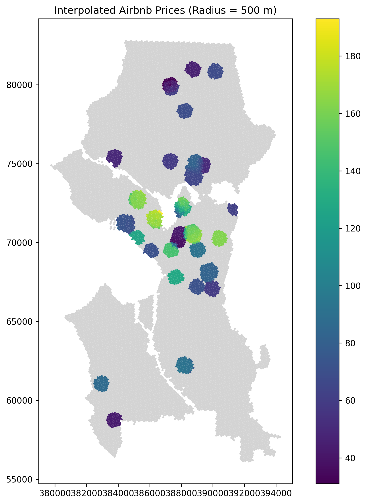

```{r setup, include=FALSE}
library(flexdashboard)
library(ggplot2)
library(readr)
library(dplyr)
library(scales)
library(htmltools)
library(leaflet)

```

Analysis {data-width=650}
-----------------------------------------------------------------------

# Graph


This map shows interpolated Airbnb prices (USD/night) across Seattle.
Each hexagon corresponds to an H3 grid cell whose centroid was used for interpolation.
Color intensity represents predicted price levels using a radius-based neighbor regression (radius = 500 m).

### Interpolated Price Map
```{r}

```

### Ok we will try to make it interactive, with zooming and all that - because of some bug (or feature) you have to click into it
```{r, fig.height=5, out.height='500px'}
library(sf)
library(leaflet)
library(viridis)  # for nice color scales

# Load the GeoPackage
seattle_grid <- st_read("seattle_grid10.gpkg")

# Transform CRS to WGS84 for Leaflet
seattle_grid_4326 <- st_transform(seattle_grid, crs = 4326)

# Create a color palette (viridis) with NA = gray
pal <- colorNumeric(
  palette = "viridis",
  domain = seattle_grid_4326$radius_500,
  na.color = "grey"
)

# Build leaflet map
leaflet(seattle_grid_4326, height = 500) %>%
  addProviderTiles(providers$CartoDB.Positron) %>%
  addPolygons(
    fillColor = ~pal(radius_500),
    color = "white",      # border color
    weight = 0.7,         # border thickness
    fillOpacity = 0.8,
    popup = ~paste0("Price To Charge: ", round(radius_500, 2))  # hover popup
  ) %>%
  addLegend(
    "bottomright",
    pal = pal,
    values = ~radius_500,
    title = "Price To Charge",
    na.label = "-",
    opacity = 1
  )
```


### Yes, that just happened
Isn`t this really cool, i think so 
HTML Retro Stuff

-----------------------------------------------------------------------

# Basic Data Information
Here we just look at the summary feature of R that entails Median and Quartile etc. For this feature, we dropped all NaN values.

```{r}
price_data <- read_csv("predicted_prices.csv")
price_data <- price_data %>% filter(!is.na(radius_500))

summary(price_data$radius_500)
```